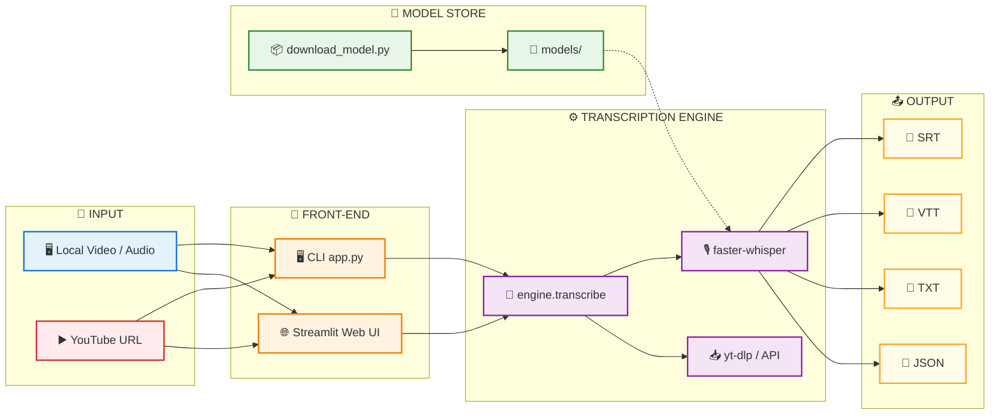
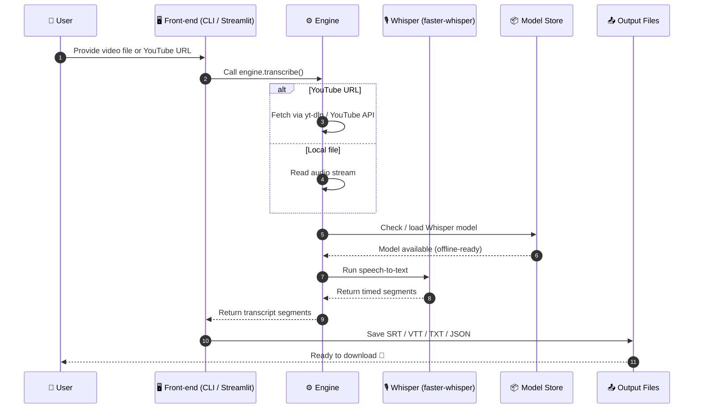

## 📺 Watch It in Action

> See this app being built and used step-by-step on **Real World Devs**!

<div align="center">

### ▶️ Complete Build Video

[](https://www.youtube.com/watch?v=Jg0rT_fRvTg)

*Click to watch the full video of building this app from scratch.*

### 🎬 Real World Devs — YouTube Channel

[](https://www.youtube.com/@realworlddevs)

</div>

### 📊 Live Output Example

Here's what the app produces — a clean, timestamped transcript ready to download:


---


# 🎬 Video Transcript Extractor

> Extract timestamped transcripts from local video files or YouTube URLs using **Whisper AI** — no API keys, no accounts, fully offline-capable.


---

## 🧭 Table of Contents

- [Architecture](#-architecture)
- [Working Flow](#-working-flow)
- [Quick Start](#-quick-start)
- [Usage](#-usage)
- [Features](#-features)
- [Project Structure](#-project-structure)

---

## 🏗️ Architecture



---

## 🔄 Working Flow



---

## 👶 No Tech Skills? No Problem!

> If you are **not a developer** — just follow these 4 simple steps. No commands, no typing, no coding.

### ✅ One-time Setup (takes ~5 minutes)

1. **Install Python** (free, one time only)
   - Go to 👉 [python.org/downloads](https://www.python.org/downloads/)
   - Click the big **"Download Python"** button and install it.
   - ⚠️ **Important:** during install, tick the box that says **"Add Python to PATH"**.

2. **Double-click `setup.bat`**
   - It lives in the same folder as this file.
   - Let it run — it will install everything and download the AI models automatically.
   - Just wait and watch. You don't need to press anything until the end.

3. **When it asks "Launch the web app now? [Y/N]"** → press **Y** and press **Enter**.
   - Your browser will open the app automatically. 🎉

### 🖱️ How to Use the App (every day)

1. A page opens in your browser called **"Video Transcript Extractor"**.
2. Choose what you have:
   - **YouTube URL** → paste a video link, *or*
   - **Upload file** → click "Browse files" and pick your video.
3. Click the big **Transcribe** button. ⏳
4. Wait a little (first run can take a few minutes — be patient). ☕
5. Your transcript appears on screen.
6. Click **Download .srt / .txt / .json** to save it to your computer. 📥

> **Trouble?** Make sure you did **Step 1** (Python with "Add to PATH"), then run `setup.bat` again.

---

## 🚀 Quick Start

> **Prerequisites:** [Python 3.10+](https://python.org) with *Add to PATH* enabled.

### 🪟 Windows (Recommended)

```batch
setup.bat
```

This script creates a virtual environment, installs dependencies, downloads Whisper models, and optionally launches the web app.

### 🐍 Manual Setup (Any OS)

```powershell
# 1. Create & activate a virtual environment
python -m venv .venv
.\.venv\Scripts\activate.ps1   # Windows PowerShell
# source .venv/bin/activate    # macOS / Linux

# 2. Install dependencies (web + CLI)
pip install -r requirements-web.txt

# 3. Download Whisper models (one-time)
python download_model.py --size small medium

# 4. Launch the web app
streamlit run webapp.py
```

Open **http://localhost:8501** in your browser. 🎉

---

## 📖 Usage

### 🌐 Web App

1. Run `streamlit run webapp.py`
2. Choose input type: **YouTube URL** or **Upload file**
3. Pick a Whisper model (`tiny`, `base`, `small`, `medium`, `large-v3`)
4. Click **Transcribe**
5. Download the transcript in your preferred format

### 💻 CLI

```powershell
# Local file
python app.py my_video.mp4

# YouTube URL
python app.py https://www.youtube.com/watch?v=XXXX --model base

# Custom formats & output directory
python app.py clip.webm --format srt vtt --output-dir ./out

# Use GPU with better precision
python app.py video.mp4 --device cuda --compute-type float16

# Offline mode (fail fast if model missing)
python app.py video.mp4 --offline
```

#### CLI Options

| Option | Description | Default |
|--------|-------------|---------|
| `--model` | Whisper model size | `small` |
| `--language` | Audio language code (e.g. `en`) | auto-detect |
| `--format` | Output formats (srt/vtt/txt/json) | `srt txt json` |
| `--output-dir` | Output directory | `./output` |
| `--device` | Compute device (`cpu`/`cuda`) | `cpu` |
| `--compute-type` | CTranslate2 compute type | `int8` |
| `--offline` | Never download anything | off |

---

## ✨ Features

- 🎙️ **Whisper AI** speech-to-text (faster-whisper)
- 📹 **Local & YouTube** video support
- 🧠 **Multiple models** — tiny, base, small, medium, large-v3
- 📦 **Multiple formats** — SRT, VTT, TXT, JSON
- 🔌 **CLI + Web UI** — Streamlit dashboard included
- 📴 **Offline mode** — models cached locally, no tokens needed
- ⚡ **GPU support** — CUDA with `float16` compute

---

## 📂 Project Structure

```
.
├── app.py                  # 🖥️ CLI entry point
├── webapp.py               # 🌐 Streamlit web UI
├── download_model.py       # 📦 Whisper model downloader
├── setup.bat               # 🪟 One-time Windows setup
├── requirements.txt        # ⚙️ Core deps (faster-whisper, yt-dlp)
├── requirements-web.txt    # 🌐 Web UI deps (streamlit, pandas)
├── models/                 # 🧠 Downloaded Whisper models
├── output/                 # 📤 Generated transcripts
├── transcript_video/       # 📚 Core package (engine, models, outputs)
└── README.md               # 📖 This file
```

---


<div align="center">

**Made with ❤️ — No API keys. No accounts. Just transcripts.**

</div>
